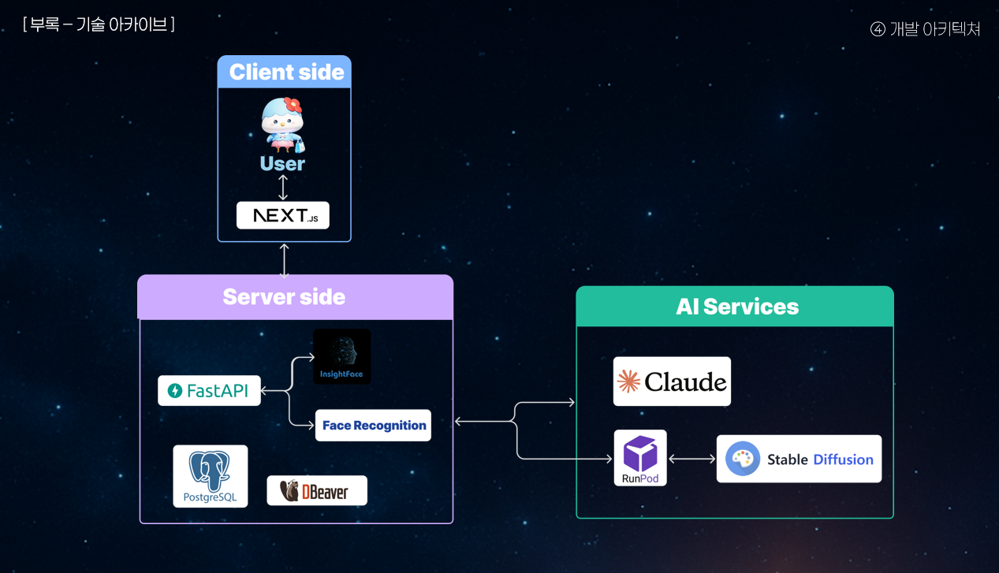

# moiMz

상상 그 이상의 모임통장, **moiMz**  
얼굴 인식 출석 기반으로 참석자들 끼리의 N등분 자동 정산,  
기억은 AI로 남기는 새로운 모임의 시작.

---

## 🧩 프로젝트 개요

> **"모임통장, 정말 ‘모임’을 위한 서비스인가?"**  
전통적인 모임통장은 회비 관리에 집중되어 있지만,  
저희는 **사람, 순간, 정산**까지 아우르는  
**진짜 모임 중심 서비스**를 만들고자 했습니다.

- 얼굴 인식 출석으로 출결을 자동 기록
- 참석자만 N등분 정산 (PISP 기반 MVP 구현)
- AI 그림일기 / 모임 캐릭터로 추억까지 보존
- 모든 구조는 개인 명의로 투명하게 처리

---

## 🔧 핵심 기능 요약

| 기능              | 설명 |
|------------------|------|
| ✋ 얼굴인식 출석     | 영상 기반 얼굴 등록 → 출석체크 자동화 |
| 💳 N등분 자동 결제  | 출석자 기준 1/N 결제 (PISP MVP 기반) |
| 🧠 AI 모임일기      | 모임 내용을 AI로 일기처럼 자동 생성 |
| 🎨 캐릭터 생성      | 소비 데이터를 바탕으로 AI 이미지 생성 |
| 📸 인물 앨범        | 모임 사진 자동 인물 분류 및 정리 |
| 🔒 개인 명의 회계관리 | 개별 락인 시스템 및 계좌 연결 가능 |

> ⏺ 서비스 화면  
>   
> 화면예시 2  
> 화면예시 3  
> 화면예시 4  
> 화면예시 5  
> 화면예시 6  

---

## ⚙️ 기술 스택

### Frontend
- **Next.js 14 (App Router)** + TypeScript
- TailwindCSS + Shadcn/UI
- Zustand + React Query
- Vercel 배포

### Backend
- **FastAPI** + SQLModel + PostgreSQL
- InsightFace 기반 얼굴 인식
- Claude / Stable Diffusion API 연동
- Render 배포

### AI/ML
- Stable Diffusion (캐릭터 생성)
- Claude (모임 일기 생성)
- InsightFace (출석 및 얼굴 클러스터링)

---

## 🧱 시스템 구조



- React 기반 UI → REST API 호출 (FastAPI)
- 얼굴 인식 → 클러스터링 및 출석 체크
- 출석 결과 → QR 생성 → 결제 API 호출
- 일정 종료 시 AI 일기 자동 생성

---

## 🚀 실행 방법

```bash
# Backend
cd backend
uvicorn main:app --reload

# Frontend
cd frontend
npm install
npm run dev
