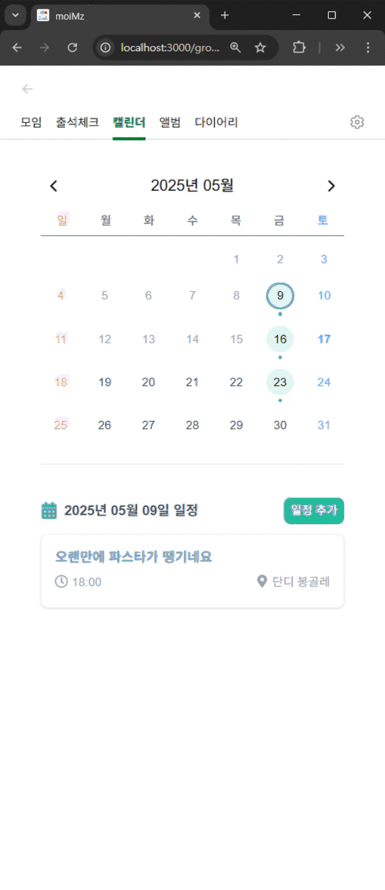
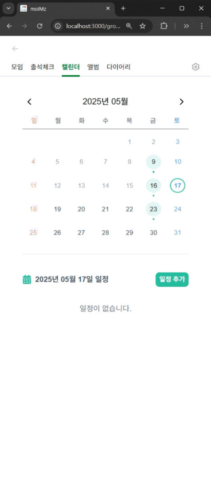
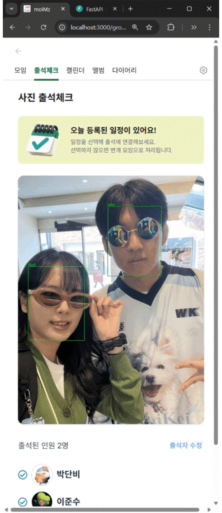
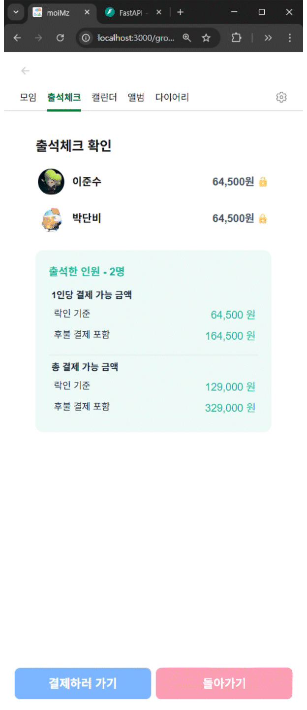
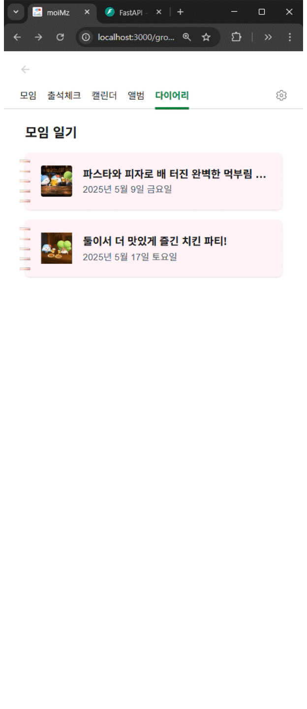
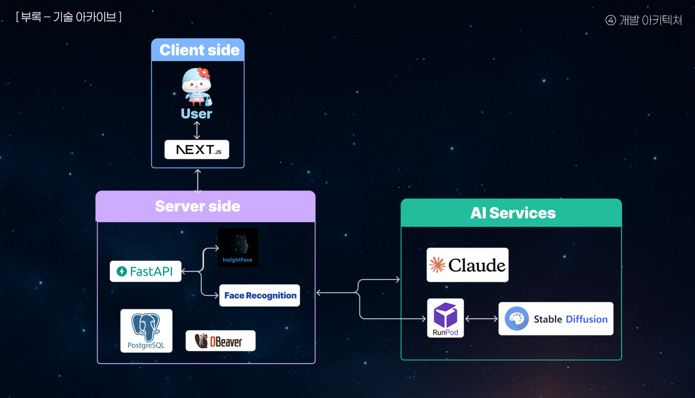

# moiMz


**상상 그 이상의 모임통장, moiMz**  
얼굴 인식 출석 기반으로 참석자들끼리의 N등분 자동 정산,  
기억은 AI로 남기는 새로운 모임의 시작.

---

## 🧩 프로젝트 개요

> **"모임통장, 정말 ‘모임’을 위한 서비스인가?"**  
> 전통적인 모임통장은 회비 관리에 집중되어 있습니다.  
> **moiMz**는 사람과 순간, 정산까지 함께 아우르는  
> **진짜 '모임 중심' 서비스**를 만들고자 했습니다.

- 얼굴 인식 출석으로 출결 자동화
- 참석자만 N등분 정산 (PISP 기반 MVP 구현)
- AI 그림일기 / 캐릭터로 추억 보존
- **개인 명의** 기반 투명한 회계 처리

---

## 🔧 핵심 기능 요약

| 기능                      | 설명                                  |
| ------------------------- | ------------------------------------- |
| ✋ **얼굴인식 출석**      | 영상 기반 얼굴 등록 → 출석 자동화     |
| 💳 **N등분 자동 결제**    | 출석자 기준 1/N 결제 (PISP MVP)       |
| 🧠 **AI 모임일기**        | 모임 내용을 AI로 일기처럼 생성        |
| 🎨 **캐릭터 생성**        | 소비 데이터를 바탕으로 AI 이미지 생성 |
| 📸 **인물 앨범**          | 사진 자동 인물 분류 및 앨범 정리      |
| 🔒 **개인 명의 회계관리** | 개별 락인 + 계좌 연동 가능            |

---

## 📱 서비스 화면 미리보기

<table>
  <tr>
    <td><b>메인 홈 / 일정 목록</b><br/></td>
    <td><b>일정 상세</b><br/></td>
    <td><b>일정 생성</b><br/></td>
  </tr>
  <tr>
    <td><b>모임비 확인 / 락인</b><br/></td>
    <td><b>사진 출석체크</b><br/></td>
    <td><b>일정 선택</b><br/></td>
  </tr>
  <tr>
    <td><b>QR 코드 생성</b><br/></td>
    <td><b>일정 종료</b><br/></td>
    <td><b>AI 모임 일기</b><br/></td>
  </tr>
</table>

---

## ⚙️ 기술 스택

### 🖥️ Frontend

- **Next.js 14 (App Router)** + TypeScript
- TailwindCSS + Shadcn/UI
- Zustand + React Query
- Vercel 배포

### ⚙️ Backend

- **FastAPI** + SQLModel + PostgreSQL
- InsightFace 기반 얼굴 인식
- Claude / Stable Diffusion API 연동
- Render 배포

### 🧠 AI/ML

- Stable Diffusion (캐릭터 생성)
- Claude (모임 일기 생성)
- InsightFace (출석 및 얼굴 클러스터링)

---

## 🧱 시스템 구조



- React 기반 UI → FastAPI REST 호출
- 얼굴 인식 → 클러스터링 → 출석 체크
- 출석 결과 → QR 생성 → 결제 API 호출
- 일정 종료 시 AI 일기 자동 생성

---

## 🚀 실행 방법

```bash
# Backend 실행
cd backend
uvicorn main:app --reload

# Frontend 실행
cd frontend
npm install
npm run dev
```
